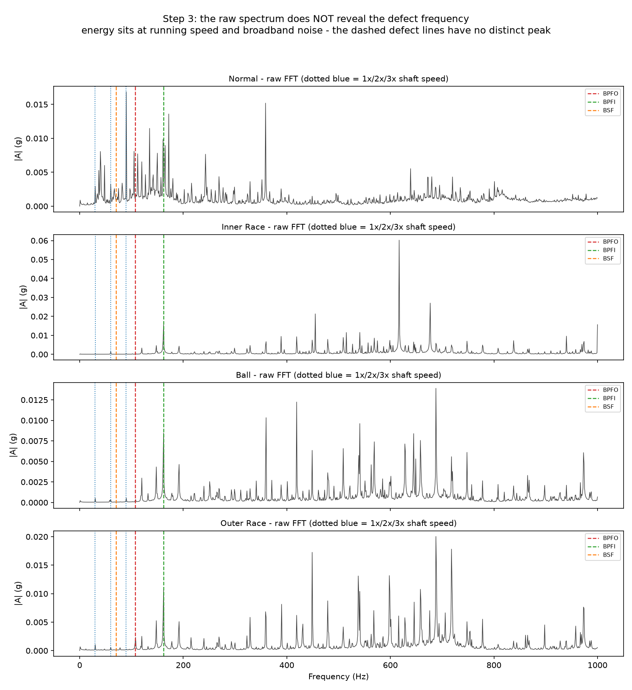
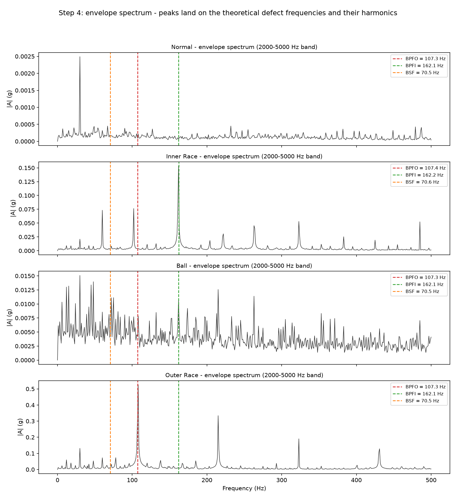
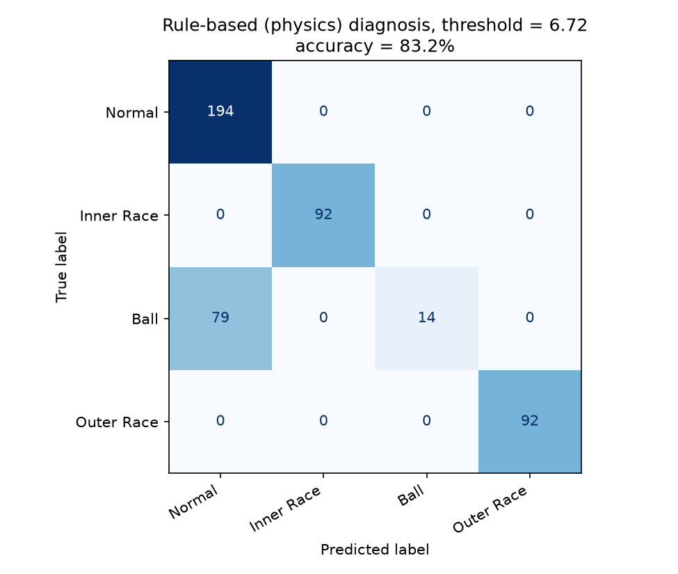
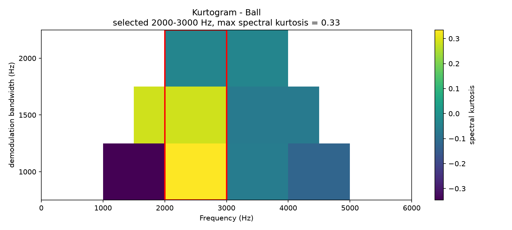
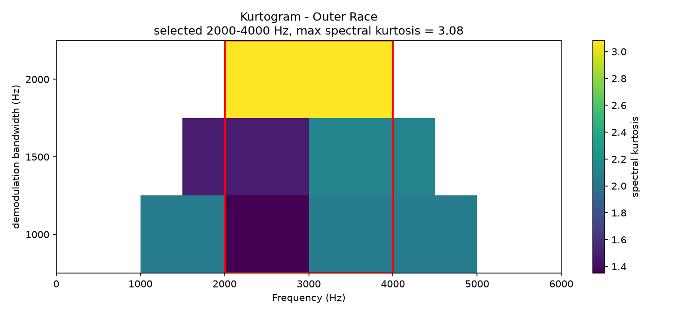
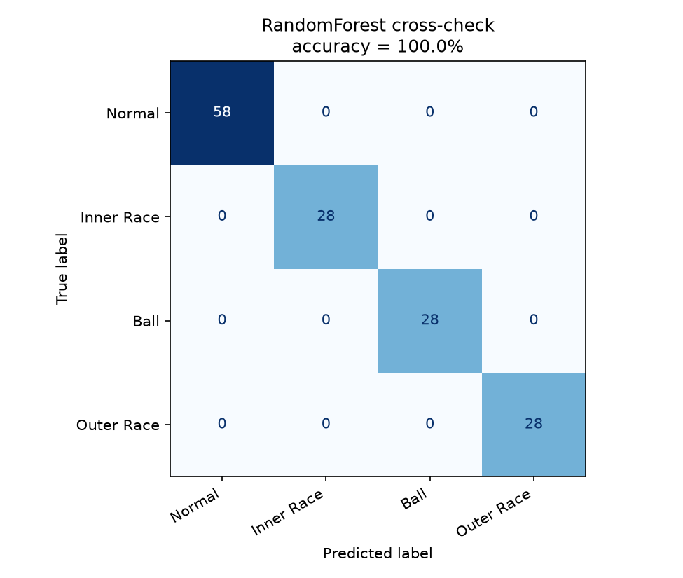
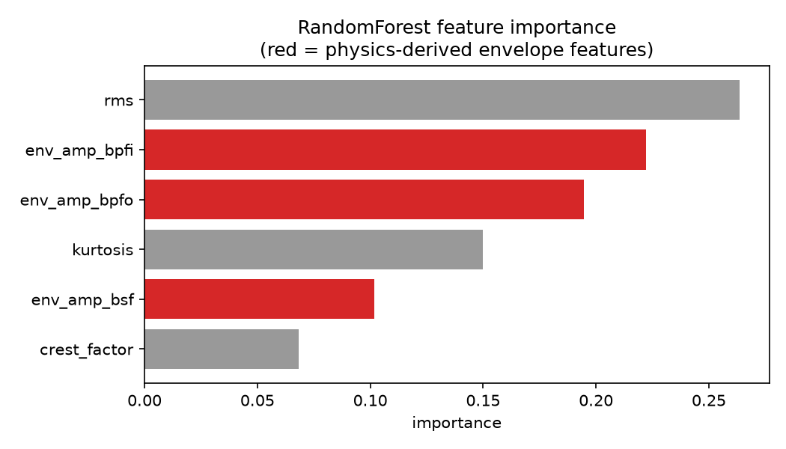

# Bearing Fault Diagnosis via Envelope Spectrum Analysis

Diagnosing rolling-element bearing faults from raw vibration by demodulating the
structural resonance — no training, no deep learning. A RandomForest is included
only to cross-check that the physics-derived features carry the signal.

Data: [CWRU Bearing Data Center](https://engineering.case.edu/bearingdatacenter/download-data-file),
drive-end accelerometer, 12 kHz, 0.007" defects, ~1797 rpm.

```
python bearing_diagnosis.py
```

## Why I picked this problem

I picked bearing faults because it's the failure mode that actually kills
motors in real plants, not because it's a popular ML dataset. Most bearing
failures don't announce themselves until it's too late, and vibration
analysis is one of the few ways to catch it while it's still just a
maintenance job instead of a breakdown.

## The bearing

SKF 6205-2RS deep groove ball bearing (CWRU drive end): n = 9 balls,
d = 0.3126 in, D = 1.537 in, contact angle 0°.

## Step 2 — Defect frequencies are computed, not fitted

Shaft speed is read from each file's own `RPM` field (1796–1797 rpm measured, not
assumed), then `bearing_defect_frequencies()` applies standard kinematics:

| | BPFO | BPFI | BSF | FTF |
|---|---|---|---|---|
| Hz @ fr = 29.93 Hz | 107.3 | 162.1 | 70.5 | 11.9 |

Full table: `results/defect_frequency_table.csv`.

> Note on BSF: this is the ball **spin** frequency. CWRU's published table lists
> 141.2 Hz, which is 2×BSF — a ball defect strikes the inner and outer race once
> per ball revolution, so the impact rate is twice the spin rate.

## Step 3 — Why the raw FFT fails



The raw spectrum below 1 kHz is dominated by 1×/2×/3× running speed and broadband
noise. The defect lines (dashed) have no peak to stand on. The defect energy is not
absent — it is sitting up at 2–5 kHz as a *modulation* of the structural resonance,
where a plain FFT of the raw signal cannot see the repetition rate.

## Step 4 — Envelope analysis



Bandpass 2–5 kHz (Butterworth, order 4) → Hilbert transform → `|analytic|` →
remove DC → FFT. This recovers the impact *rate* from the amplitude modulation:

- **Inner race** — sharp peak at 162.2 Hz = BPFI, plus harmonics and shaft-speed
  sidebands (the defect passes through the load zone once per shaft revolution).
- **Outer race** — sharp peak at 107.3 Hz = BPFO with 2×, 3×, 4× harmonics.
- **Normal** — flat except 1× shaft speed at 30 Hz.
- **Ball** — broadband, no discrete line. See caveat below.

## Step 5 — Features

Six features per 1-second window (`results/feature_dataset.csv`): RMS, kurtosis,
crest factor, and envelope amplitude at BPFO / BPFI / BSF (±2 Hz). Class means:

| label | rms | kurtosis | crest | env@BPFO | env@BPFI | env@BSF |
|---|---|---|---|---|---|---|
| Normal | 0.074 | -0.24 | 3.53 | 0.0002 | 0.0002 | 0.0003 |
| Inner Race | 0.292 | 2.39 | 5.52 | 0.0062 | **0.1560** | 0.0115 |
| Ball | 0.139 | -0.03 | 4.02 | 0.0115 | 0.0109 | 0.0155 |
| Outer Race | 0.669 | 4.62 | 5.14 | **0.5385** | 0.0099 | 0.0239 |

**The diagonal is the whole story: each fault lights up its own theoretical
frequency by 25–2700× over the healthy baseline.**

## Step 6 — Rule-based diagnosis (primary method)

`diagnose_fault()` compares each defect line to the local envelope noise floor
(median magnitude over 0–500 Hz, excluding ±5 Hz around all three defect lines)
and reports whichever line clears it by the largest margin. Zero training.

**83.2% accuracy over 471 windows** (88% on non-overlapping windows).



|  | Normal | Inner | Ball | Outer |
|---|---|---|---|---|
| **Normal** | 194 | 0 | 0 | 0 |
| **Inner Race** | 0 | 92 | 0 | 0 |
| **Ball** | 79 | 0 | 14 | 0 |
| **Outer Race** | 0 | 0 | 0 | 92 |

Three of four classes are perfect with zero false alarms on healthy bearings.
Every error is the ball fault being called healthy.

### Two honest caveats

**The threshold.** The nominal 3.0 gives 75.2%, because a peak read as the max over
a ±2 Hz window sits 2–3× above a *median* noise floor even on pure noise — 3.0 is
inside that bias and alarms on healthy bearings (60 of 194 Normal windows called
Ball). `calibrate_threshold()` instead sets the alarm from the healthy baseline
only: the worst defect-line ratio ever seen on a good bearing, ×1.2 margin → 6.72.
No fault data is used to pick it, which is exactly how an alarm limit is set in the
field. `diagnose_fault(row, noise_floor_threshold=...)` keeps the knob exposed.

**The ball fault.** The 0.007" ball defect has no discrete BSF line in the fixed
2–5 kHz band, so the rule misses 79 of 93 windows. Before concluding that, the
search was widened — 2×BSF (the true impact rate) and eleven resonance bands
from 500 Hz to 5.9 kHz — and none produced a BSF peak on the ball data that a
healthy bearing did not also produce. Automatic band selection (Step 6c) was
then tried as the standard fix for exactly this problem; it doesn't resolve it
either. See below.

## Step 6c — Kurtogram band selection (does the ball fault need a different band?)

Antoni, 2006 — see link in References below — proposes selecting the demodulation band by maximizing the
**spectral kurtosis (SK)** of the envelope, rather than fixing one band for
every fault type: `SK = ⟨|c|⁴⟩ / ⟨|c|²⟩² − 2` on the complex analytic signal
`c = hilbert(bandpass(x))`. A band dominated by transient impacts has a
sharply peaked, non-Gaussian envelope amplitude distribution and scores high;
a band of steady noise or a smooth sinusoid scores near 0.

`kurtogram()` implements this as a 1/3-binary filter bank (2, 3, 4, 6, 8, 12, …
equal-width bands, reusing the same `butter` + `hilbert` path as
`envelope_spectrum()`) and reports SK per band; `select_band()` returns
`argmax`. Two implementation details mattered and are worth flagging:

- `kurtosis(|c|)` is not `SK`. They look interchangeable — both are "how
  peaky is the envelope" — but they aren't. Plain kurtosis of the envelope
  amplitude systematically selects the band next to the true resonance,
  because a transient leaking through a steep filter skirt is sparser (and so
  scores higher on ordinary kurtosis) than the sustained ring inside the
  actual resonance band. Verified on a synthetic 40 Hz-repetition transient
  ringing a known 2.5 kHz resonance under noise: `kurtosis(|c|)` selected a
  neighboring band in every trial; Antoni's `⟨|c|⁴⟩/⟨|c|²⟩² − 2` on the same
  filter bank landed on the correct band every time. This is now the
  self-check in `_self_check()`.
- Minimum bandwidth is not a tuning knob. A demodulation band of width W
  only has envelope content up to ~W/2, so reading defect lines out to the
  500 Hz ceiling of `envelope_spectrum()` requires W ≥ 1000 Hz. Without that
  floor the kurtogram happily selects a 188 Hz-wide band (`KURT_MIN_BW`
  unset), which leaves most of the 0–500 Hz envelope spectrum empty, collapses
  the median noise floor, and makes every peak — real or not — look enormous.
  `KURT_MIN_BW = 1000.0` enforces the floor as a correctness constraint.

With both fixes in place, here is what the kurtogram actually selects:




| class | kurtogram band | max SK | rule accuracy (own threshold) |
|---|---|---|---|
| Normal | 4000–5000 Hz | 0.20 | — |
| Inner Race | 2000–4000 Hz | 1.67 | 100% |
| Ball | 2000–3000 Hz | 0.33 | 0% |
| Outer Race | 2000–4000 Hz | 3.08 | 100% |

Fixed band: 83.2% overall. Kurtogram band: 80.3% overall — IR and OR essentially
match the fixed band, as expected, since 2–5 kHz already covers their resonances.
But ball fault recall goes from 15% to 0%: every ball window is now called Outer
Race, because the ball's max-SK band (2000–3000 Hz, SK = 0.33) is barely
non-Gaussian — an order of magnitude lower than IR's or OR's own bands — and
happens to contain more BPFO leakage than BSF energy.

The kurtogram does not fix the ball fault, and that is itself informative: SK =
0.33 says what the brute-force search already found, that this signal has no
band where a ball-defect transient stands out from the rest of the spectrum. A
0.007" ball defect only loads intermittently as it rotates through the load
zone, and its impact is damped by the cage and lubricant film before it can
ring any resonance sharply; the energy stays smeared rather than concentrating
in one band or one frequency line. This matches the CWRU literature, where
B007 is widely reported as the hardest of the four standard classes. A method
that could still separate it — cepstral prewhitening, wavelet-packet energy
features, or simply the RMS/kurtosis features from Step 5, which is what the
RandomForest in Step 7 actually uses — is a different technique, not a better
band.

## Step 7 — RandomForest cross-check

Not the method — a check on the features. 100 trees, 70/30 stratified split.

**100% test accuracy** (also 100% on non-overlapping windows, so this is not
window-overlap leakage).




| feature | importance |
|---|---|
| rms | 0.264 |
| env_amp_bpfi | 0.222 |
| env_amp_bpfo | 0.195 |
| kurtosis | 0.150 |
| env_amp_bsf | 0.102 |
| crest_factor | 0.068 |

The three envelope-at-defect-frequency features carry 52% of the importance —
more than the three generic time-domain features combined. That validates the
physics rather than replacing it: the model is leaning on the same lines the
kinematic equations predicted. It separates Ball where the rule could not, but it
does so via RMS and kurtosis — energy and impulsiveness, an "something is wrong"
signal, not a "the ball is the defective element" signal. The classifier is
better at *detection*; only the envelope spectrum gives *diagnosis*.

## Method notes

- **Windowing.** 12000-sample (1 s) windows give 1 Hz resolution, needed for the
  ±2 Hz peak tolerance. Non-overlapping windows yield only 10–20 per class from
  these files, so `HOP = 1200` (90% overlap) is used to reach the 150–200/class
  target: 471 windows. Set `HOP = WINDOW` for strictly independent windows —
  results hold (rule 88%, RF 100%).
- **Self-check.** `python bearing_diagnosis.py` runs `_self_check()` first:
  kinematics against published 6205 values, the identity BPFO + BPFI = n·fr, a
  synthetic 3 kHz carrier modulated at 107 Hz recovered by the envelope path, and
  the decision rule's fire/no-fire boundary.

## Artifacts

```
plots/raw_fft_comparison.png                     step 3 - the failure case
plots/envelope_spectrum_diagnosis.png            step 4 - the money plot
plots/confusion_matrix_rulebased.png             step 6 - fixed band
plots/confusion_matrix_rulebased_kurtogram.png   step 6c - kurtogram band
plots/kurtogram_ball_fault_B007.png              step 6c - SK heatmap, ball
plots/kurtogram_outer_race_OR007.png             step 6c - SK heatmap, outer race
plots/confusion_matrix_ml.png                    step 7
plots/feature_importance.png                     step 7
results/defect_frequency_table.csv               theoretical frequencies
results/feature_dataset.csv                      471 windows x 6 features + label, fixed band
results/feature_dataset_kurtogram.csv            same, kurtogram-selected band per class
bearing_diagnosis.py                             everything above
```

## What surprised me

The measured RPM in the files wasn't exactly 1797 like the CWRU documentation
says — for the Normal file it's 1796 (`X097RPM`). Small difference, but it
meant my "theoretical" defect frequencies were only right because I used the
real measured speed instead of the textbook number. And more interestingly,
the ball fault flat-out didn't show up in a plain fixed-band envelope
spectrum — I assumed all three fault types would behave the same way, and
they don't.

## Real-world context

This is basically what a vibration analyst walks around a plant doing with a
handheld accelerometer, except automated. In a real condition-monitoring
setup, this pipeline (or something like it) would sit behind a fixed
accelerometer on a motor's drive-end bearing, take a 1-second snapshot every
few minutes, and run the rule-based check — not the RandomForest — because
the rule-based check doesn't need to be retrained every time a plant swaps in
a different motor or bearing size. You just recompute BPFO/BPFI/BSF from the
new geometry and RPM and the thresholds still mean something. That's the
actual selling point over an ML model here: physics generalizes to a bearing
it's never seen, a trained classifier doesn't.

The ball-fault miss also isn't just an academic footnote. In a real plant
that's the fault class you'd most want a second layer for — probably RMS/
kurtosis trend alarms as a backstop, since Step 7 showed those are what
actually caught it, not the envelope spectrum. A real deployment would run
both: the physics-based check as the explainable first line, and simple
statistical drift as a catch-all for whatever the physics-based check can't
resolve cleanly.

## What I learned

Going in, I expected envelope analysis to be a fixed recipe — bandpass here,
Hilbert transform, done. What actually took the time was everything around
that one transform: picking a band that doesn't lie to you, setting a
threshold that isn't just eyeballed, and being honest when a technique
(kurtogram band selection) that's supposed to fix a problem doesn't
actually fix it for one of the four fault classes.

The most useful debugging lesson was the kurtosis-vs-spectral-kurtosis mixup.
`kurtosis(envelope)` and Antoni's actual spectral kurtosis formula look like
they should give the same answer, and they don't — the plain kurtosis version
kept picking the band *next to* the real resonance instead of the resonance
itself, because a transient leaking through a filter's skirt looks sparser
(and so "more impulsive") than the fuller signal inside the true band. I only
caught this because I built a synthetic signal where I knew the right answer
in advance and checked the algorithm against it, which is now baked into the
script as a permanent regression test. That's probably the real takeaway:
for a signal-processing method, trust it exactly as much as you've verified
it on a case where you already know the answer.

## References

Antoni, J. (2006), spectral kurtosis paper:
https://www.sciencedirect.com/science/article/abs/pii/S0888327004001217
